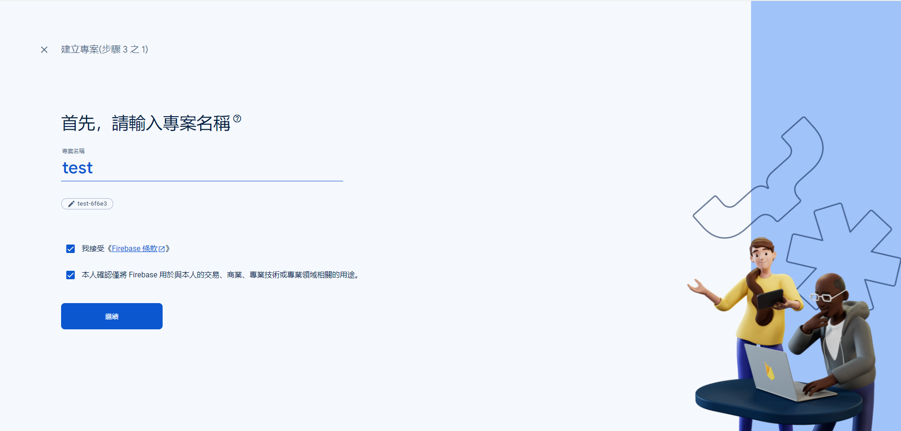
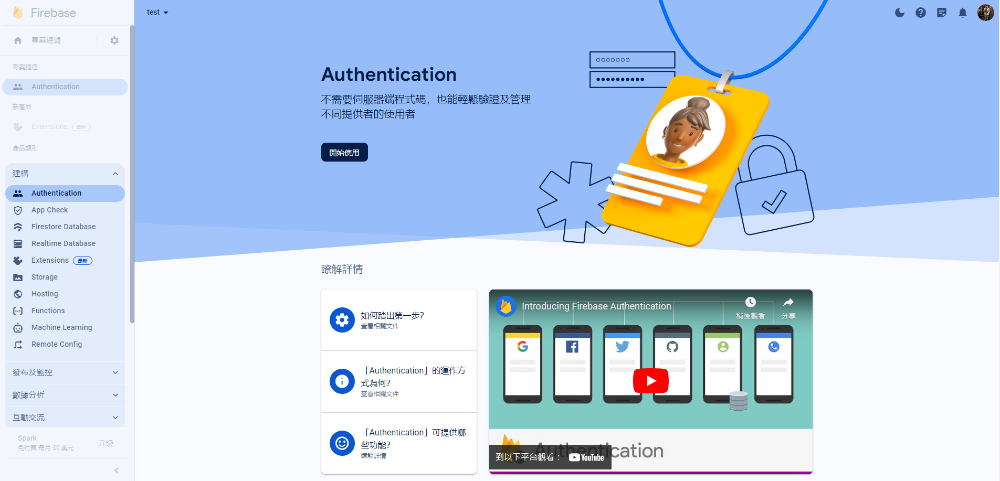
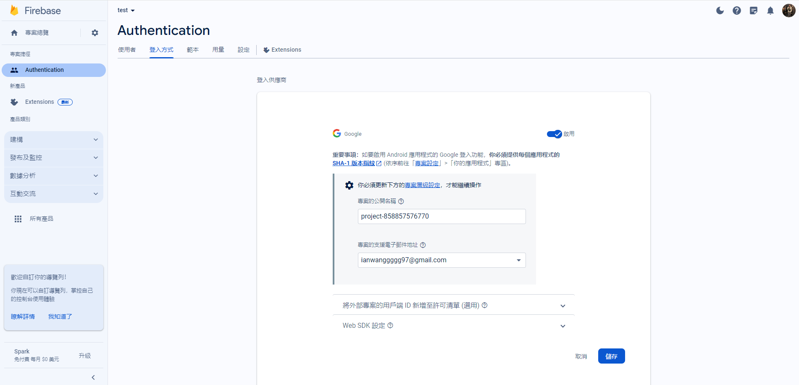
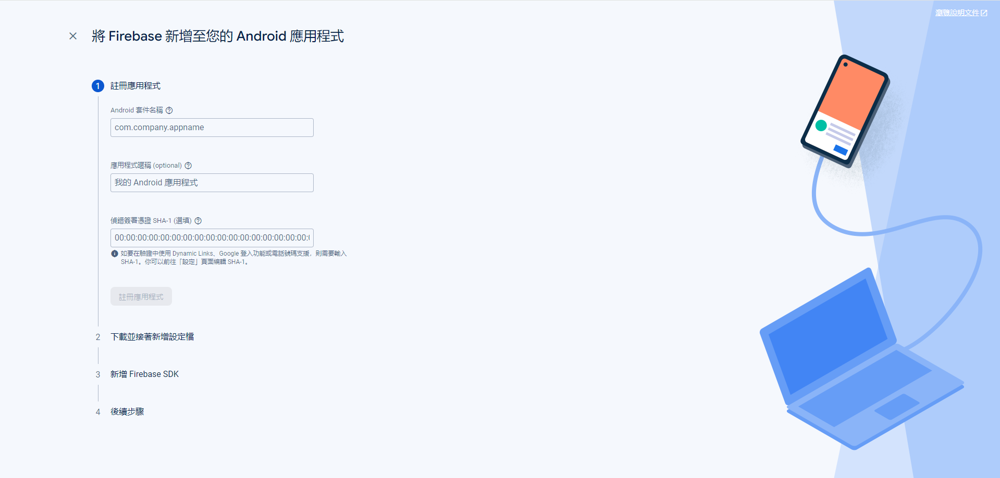
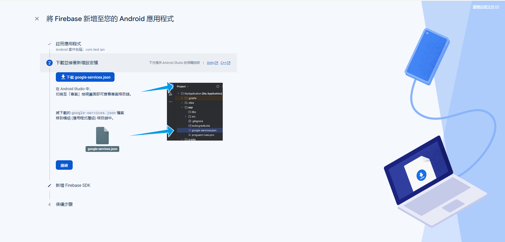
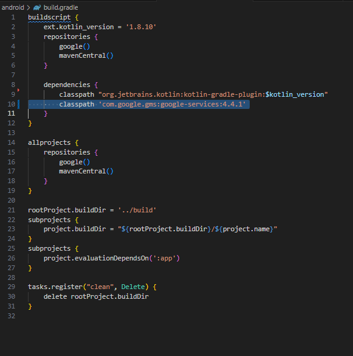
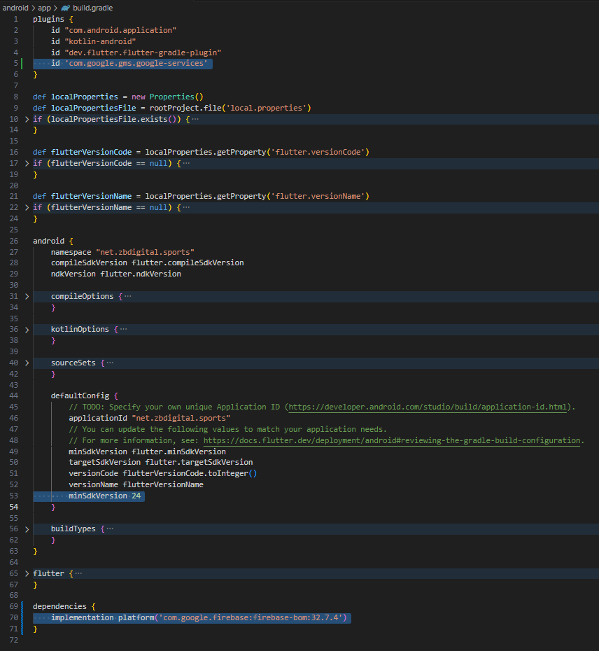

# GoogleLogin with Firebase

### 1. [Firebase官網](https://console.firebase.google.com/?_gl=1*jnxxbm*_ga*MTE2NjIzNTMzNS4xNzExMzQ5MTc0*_ga_CW55HF8NVT*MTcxMTM0OTE3My4xLjEuMTcxMTM0OTE3OS41NC4wLjA.) 按照步驟建立新專案
+ 

### 2. 進入建立好的專案
+ 

### 3. 建立Authentication，點選【其他供應商/Google】，選擇啟用
+ 
+ 

### 4. 建立Android應用程式
+ Android 套件名稱在Flutter專案 > ./android/app/build.gradle > defaultConfig > applicationId  
+ 偵錯簽署憑證這裡可以先跳過
+ 

### 5. 將google-services.json放到Flutter專案 > ./android/app 中
+ 

### 6. 將FirebaseSDK導入Flutter專案
+ ./android/build.gradle > dependencies 下新增【classpath 'com.google.gms:google-services:X.X.X'】(X.X.X為Firebase導覽上顯示的版本)  
+ 

+ ./android/app/build.gradle > plugin 下新增【id 'com.google.gms.google-services'】  
+ defaultConfig > minSdkVersion 改為 23 以上
+ dependencies下新增【implementation platform('com.google.firebase:firebase-bom:X.X.X')】(X.X.X為Firebase導覽上顯示的版本)
+ 

### 7. 修改main.dart > main()
```dart
void main() async {
  WidgetsFlutterBinding.ensureInitialized();
  Platform.isAndroid ? await Firebase.initializeApp(
          options: FirebaseOptions(
          apiKey: 【google-services.json中的api_key.current_key】,
          appId: 【google-services.json中的mobilesdk_app_id】,
          messagingSenderId: 【googleservices.json中的project_number】,
          projectId: 【google-services.json中的project_id】,
        ))
      : await Firebase.initializeApp();
  runApp(const MyApp());
}
```

### 8. Firebase專案中新增SHA金鑰
+ [怎麼取得SHA金鑰](https://github.com/IanWangIITZDAWG/SHA-key)

### 9. Flutter專案新增【google_sign_in】套件

### 10. 開始使用
+ [使用方法點我](https://firebase.google.com/docs/auth/flutter/federated-auth?hl=zh-tw#google)
```dart
import 'package:google_sign_in/google_sign_in.dart';

Future<UserCredential> signInWithGoogle() async {
  // Trigger the authentication flow
  final GoogleSignInAccount? googleUser = await GoogleSignIn().signIn();

  // Obtain the auth details from the request
  final GoogleSignInAuthentication? googleAuth = await googleUser?.authentication;

  // Create a new credential
  final credential = GoogleAuthProvider.credential(
    accessToken: googleAuth?.accessToken,
    idToken: googleAuth?.idToken,
  );

  // Once signed in, return the UserCredential
  return await FirebaseAuth.instance.signInWithCredential(credential);
}
```